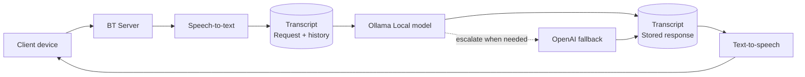

# BT

BT is a local-first, voice-native personal assistant with a personality inspired by BT-7274 from *Titanfall 2*. It runs a conversational core locally through Ollama, keeps transcripts in SQLite, and can escalate a turn to OpenAI when asked or when the local response fails.

This repository contains the phase-one desktop hub: a FastAPI service with text chat, an optional voice pipeline, and a small developer dashboard. Clients and external integrations are deliberately out of scope for now. See [the design document](docs/DESIGN.md) for the architecture, routing policy, and future direction.

## Architecture



## Current status

The text conversational core is ready for development use. The voice pipeline is available behind an opt-in setting.

- [x] Local chat through Ollama
- [x] Local-first routing with an optional OpenAI fallback
- [x] SQLite-backed session transcripts
- [x] Optional speech-to-text and text-to-speech pipeline
- [x] Developer dashboard for live transcripts
- [ ] Cross-platform clients and external integrations

OpenAI fallback has not yet been fully tested end-to-end.

## Requirements

- Python 3.11 or later
- [uv](https://docs.astral.sh/uv/)
- [Ollama](https://ollama.com/) running locally
- An Ollama chat model that matches `BT_OLLAMA_MODEL`

Voice mode also needs FFmpeg, PortAudio, and Piper. The Nix development shell provides these dependencies.

## Quick start

### NixOS / Nix

Enter the development shell and install the Python dependencies:

```sh
nix develop
uv sync
```

Ensure the Ollama service is running, then pull a model. For example:

```sh
ollama pull qwen2.5:14b
```

Create your local configuration and set the model to the one you pulled:

```sh
cp .env.example .env
```

In `.env`, add:

```dotenv
BT_OLLAMA_MODEL=qwen2.5:14b
```

Start BT:

```sh
uv run bt
```

### Other systems

Install the system dependencies required by the features you intend to use, then install the project dependencies:

```sh
uv sync
```

Install and start Ollama, pull a model, and configure BT as above:

```sh
ollama pull qwen2.5:14b
cp .env.example .env
```

Set `BT_OLLAMA_MODEL=qwen2.5:14b` in `.env`, then run:

```sh
uv run bt
```

## Using BT

`uv run bt` starts the service on `http://127.0.0.1:8080`. Confirm it is available with:

```sh
curl http://127.0.0.1:8080/health
```

Send a text turn to the chat API:

```sh
curl http://127.0.0.1:8080/chat \\
  -H 'content-type: application/json' \\
  -d '{"text":"Hello, BT."}'
```

The response includes a `session_id`; pass it back as `session_id` in later requests to continue that conversation. BT records the input and response, along with the provider that answered, in its SQLite transcript database.

For a development server on port 8081, run:

```sh
uv run bt-dev
```

To enable the developer dashboard, set either `BT_DEVELOPER_MODE=1` or `BT_DEVUI=1` in `.env`, then open `/dev` on the active server—for example, `http://127.0.0.1:8081/dev` when using `bt-dev`.

## Remote access over Tailscale

With Tailscale already set up on both machines, set `BT_HOST` on the server:

- `BT_HOST=0.0.0.0` listens on every interface. Only open the port on `tailscale0`; on NixOS, use `networking.firewall.interfaces.tailscale0.allowedTCPPorts = [ 8080 ];`.
- `BT_HOST=<tailscale ip>` (from `tailscale ip -4`) listens only on the tailnet, but then `127.0.0.1` no longer reaches BT.

BT has no authentication, so don't bind it to an interface that isn't trusted.

Then, from another tailnet device:

```sh
curl http://<bt-host>:8080/health
```

### Standalone dashboard

To test remote voice from another device, run the dashboard on that device:

```sh
uv run bt-devui
```

Open `http://127.0.0.1:8082/dev?server=http://<bt-host>:8080`, or type the server into the dashboard's header field. Because the page is served from localhost, the browser allows mic access without HTTPS. The server still needs `BT_VOICE=1`. To show model names, it also needs `BT_DEVUI=1`.

## Configuration

Copy [.env.example](.env.example) to `.env`; all options have sensible defaults unless noted otherwise.

| Setting | Purpose | Default |
| --- | --- | --- |
| `BT_OLLAMA_URL` | Ollama server URL | `http://127.0.0.1:11434` |
| `BT_OLLAMA_MODEL` | Local chat model | `qwen3:8b` |
| `OPENAI_API_KEY` | Enables cloud escalation | none |
| `BT_OPENAI_MODEL` | Cloud fallback model | `gpt-5.6-luna` |
| `BT_HOST` | Server bind address (see [Remote access](#remote-access-over-tailscale)) | `127.0.0.1` |
| `BT_DB_PATH` | SQLite transcript database path | `bt.sqlite3` |
| `BT_VOICE` | Enable voice mode when set to `1` | off |
| `BT_DEVELOPER_MODE` | Enable developer tooling and dashboard when set to `1` | off |
| `BT_DEVUI` | Enable only the developer dashboard when set to `1` | off |

`bt-dev` loads `.env.dev` before `.env`, so it is useful for local development overrides. Shell environment variables take precedence over either file.

## Model routing

BT normally uses Ollama. It escalates to the configured OpenAI model when you explicitly ask it to “think harder,” “use your best model,” or “escalate,” and also when the local response is malformed or the Ollama request fails. Configure `OPENAI_API_KEY` before relying on this fallback.

## Project layout

- `bt/gateway/` — HTTP chat gateway and health endpoint
- `bt/llm/` — local/cloud model routing
- `bt/voice/`, `bt/stt/`, and `bt/tts/` — optional voice pipeline
- `bt/transcript/` — SQLite-backed sessions and turns
- `bt/personality/SOUL.md` — personality source used to build the system prompt
- `docs/DESIGN.md` — design decisions and phase-two ideas
